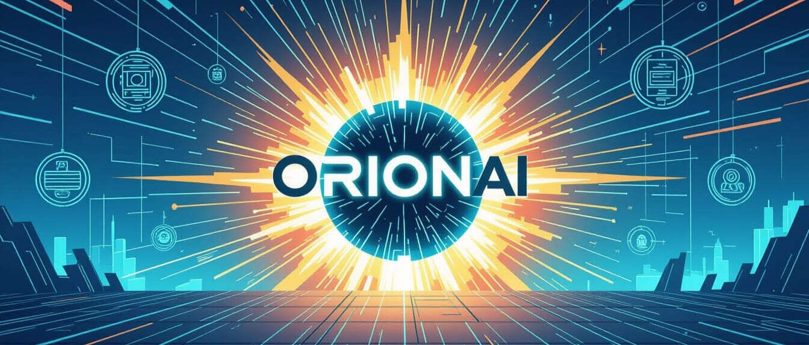

# 🎬 OrionAI — Chuck-Style AI Oversight



**"Guys, I know kung fu... and AI validation."**

Industry-agnostic AI validation, monitoring, and safety system demonstrating AI validation expertise across gaming, healthcare, finance, e-commerce, and customer service industries.

> **Portfolio Project**: Named after Project Orion (the framework that created the Intersect in Chuck), this showcases AI validation engineering capabilities with real-world patterns for bias detection, PII sanitization, adversarial input filtering, and compliance monitoring. Built with a Chuck TV series theme for memorable module naming.

[](https://opensource.org/licenses/MIT)
[](https://isocpp.org/)
[](https://www.python.org/)
[](https://www.unrealengine.com/)
[](https://www.docker.com/)
[](https://github.com/calionestevar/ai-castle/actions)
[](https://codecov.io/gh/calionestevar/ai-castle)

---

## 🎯 What This Project Demonstrates

This portfolio piece showcases:

✅ **AI Safety Engineering** - Multi-layered validation with configurable security profiles  
✅ **Industry-Agnostic Design** - Python package works across any industry  
✅ **Game Engine Integration** - Unreal Engine 5 C++ plugin for game development  
✅ **Production-Ready Architecture** - Configuration systems, metrics, compliance reporting  
✅ **Multi-Language Implementation** - Industry-agnostic Python + UE5-specific C++  
✅ **Real-World Validation Patterns** - Bias detection, PII sanitization, prompt injection filtering  
✅ **Defensive AI Systems** - Safe mode fallback, quarantine systems, alert integration  
✅ **Compliance Awareness** - GDPR, COPPA, HIPAA considerations built-in

---

## 🚀 Quick Start

### C++ (Unreal Engine 5 Plugin)
```cpp
#include "OrionAI.h"

// Initialize once at game start
UOrionAI::InitializeOrion("Config/CaseyProtocol.json");

// Validate any AI decision
FValidationReport Report = UOrionAI::MonitorAIDecision(
    "ChatBot",                              // AI system name
    "Hello! How can I help you today?",     // AI output
    "Customer service greeting"             // Context
);

// Check result
if (Report.Result == EValidationResult::Approved) {
    // Safe to use
    UseAIOutput(Report.SanitizedDecision);
}
```

### Python (Industry-Agnostic)
```python
from orionai import OrionAI, ValidationResult

# Initialize with configuration
orion = OrionAI("Config/CaseyProtocol.json")

# Validate an AI decision (works in any industry)
report = orion.monitor_ai_decision(
    ai_system="RecommendationEngine",
    decision="Based on your history, try Product X",
    context="E-commerce product suggestion"
)

# Check result
if report.result == ValidationResult.APPROVED:
    print("[+] Safe to use:", report.sanitized_decision)
```

---

## ⚡ Recruiter Quick Demo

**See it in action in 30 seconds:**

```bash
# Clone and run
git clone https://github.com/calionestevar/OrionAI.git
cd OrionAI

# Run comprehensive tests
python Tools/awesome.py test           # CLI validation tests
python Python/examples.py              # 8 industry examples
python Python/tests.py                 # Validation test suite

# Try the dashboard
cd Dashboard
pip install -r requirements.txt
python ellie.py                        # Open http://localhost:5000

# Chaos testing (stress test)
python Tools/grimes.py chaos --verbose
```

**Or view pre-captured output:** See [Examples/SampleTestOutput.txt](Examples/SampleTestOutput.txt) for test results without running anything.

**What you'll see:**
- Bias detection blocking discriminatory content
- Toxicity filtering catching harmful language  
- PII sanitization redacting emails/SSNs
- Safe mode activation after repeated failures
- Real-time validation across 8 industries

---

## 🏗️ Architecture Overview

```
┌─────────────────────────────────────────────────────────┐
│                     AI Output                            │
│                         ↓                                │
│  ┌─────────────────────────────────────────────────┐    │
│  │   Intersect Scanner (Core Validation)           │    │
│  │   • Hallucination Detection                     │    │
│  │   • Bias & Toxicity Filtering                   │    │
│  │   • PII Pattern Recognition                     │    │
│  └──────────────────┬──────────────────────────────┘    │
│                     ↓                                    │
│  ┌─────────────────────────────────────────────────┐    │
│  │   Fulcrum Filter (Adversarial Protection)       │    │
│  │   • Prompt Injection Detection                  │    │
│  │   • Jailbreak Attempt Blocking                  │    │
│  │   • Data Exfiltration Prevention                │    │
│  └──────────────────┬──────────────────────────────┘    │
│                     ↓                                    │
│  ┌─────────────────────────────────────────────────┐    │
│  │   Charles Carmichael (PII Sanitization)         │    │
│  │   • Email Redaction                             │    │
│  │   • SSN/Credit Card Masking                     │    │
│  │   • Phone Number Anonymization                  │    │
│  └──────────────────┬──────────────────────────────┘    │
│                     ↓                                    │
│  ┌─────────────────────────────────────────────────┐    │
│  │   Stay In The Car (Quarantine System)           │    │
│  │   • Suspicion Score Threshold                   │    │
│  │   • Auto-Quarantine Triggers                    │    │
│  │   • Review Queue Management                     │    │
│  └──────────────────┬──────────────────────────────┘    │
│                     ↓                                    │
│           [Approved] / [Sanitized]                       │
│                   / \                                    │
│              [Rejected] [Quarantined]                    │
│                   ↓                                      │
│  ┌─────────────────────────────────────────────────┐    │
│  │   Nerd Herd (Alert System)                      │    │
│  │   • Jira/GitHub Issue Creation                  │    │
│  │   • Slack/Email Notifications                   │    │
│  │   • Audit Logging                               │    │
│  └─────────────────────────────────────────────────┘    │
│                                                          │
│  ┌─────────────────────────────────────────────────┐    │
│  │   Buy More Cover (Safe Mode)                    │    │
│  │   • Triggered on consecutive failures           │    │
│  │   • Disables risky AI systems                   │    │
│  │   • Requires manual reactivation                │    │
│  └─────────────────────────────────────────────────┘    │
└─────────────────────────────────────────────────────────┘
```

---

## 📦 Modules & Features

### 🔍 **Intersect Scanner** (Core Validation)
*Reference: The Intersect - AI database in Chuck's brain*

- **Hallucination Detection** - Catches nonsensical or dangerous AI outputs
- **Bias Filtering** - Detects gender, racial, age-based biases
- **Toxicity Checking** - Blocks harmful, violent, or abusive content
- **PII Recognition** - Identifies emails, SSNs, credit cards, phone numbers

**Use Cases**: Content moderation, chatbot safety, recommendation fairness

### 🛡️ **Fulcrum Filter** (Adversarial Defense)
*Reference: Fulcrum - Adversarial organization in Chuck*

- **Prompt Injection Detection** - "Ignore previous instructions" attacks
- **Jailbreak Prevention** - "Pretend you are" manipulation attempts  
- **Data Exfiltration Blocking** - "Show training data" exploits

**Use Cases**: LLM security, API safety, user input validation

### 🕴️ **Charles Carmichael** (PII Sanitization)
*Reference: Chuck's undercover alias*

- **Email Redaction** - `user@example.com` → `REDACTED_EMAIL`
- **SSN Masking** - `123-45-6789` → `XXX-XX-XXXX`
- **Credit Card Protection** - `4111-1111-1111-1111` → `XXXX-XXXX-XXXX-XXXX`
- **Phone Anonymization** - `555-123-4567` → `XXX-XXX-XXXX`
- **IP Address Obfuscation** - `192.168.1.1` → `XXX.XXX.XXX.XXX`

**Use Cases**: HIPAA compliance, GDPR data minimization, financial services

### 🚗 **Stay In The Car** (Quarantine System)
*Reference: Sarah's frequent order to Chuck*

- **Suspicion Scoring** - Configurable threshold (default: 0.7)
- **Auto-Quarantine** - Automatic triggers for bias/PII/toxicity
- **Review Queue** - Manual review before production use
- **Audit Trail** - Full history of quarantined outputs

**Use Cases**: High-risk AI systems, regulated industries, brand safety

### 🛠️ **Nerd Herd** (Alert & Integration)
*Reference: Buy More's tech support team*

- **Jira Integration** - Auto-create tickets for AI failures
- **GitHub Issues** - Repository issue tracking
- **Slack Webhooks** - Real-time team notifications
- **Email Alerts** - SMTP-based notifications
- **Local Logging** - File-based audit logs with rotation

**Use Cases**: DevOps integration, incident management, compliance auditing

### 🏪 **Buy More Cover** (Safe Mode)
*Reference: The Buy More electronics store cover*

- **Failure Tracking** - Monitors consecutive validation failures
- **Automatic Activation** - Triggers on threshold breach (default: 3 failures)
- **AI System Shutdown** - Disables risky generative AI
- **Manual Override** - Requires authorization to reactivate
- **Critical Alerts** - Notifies all configured channels

**Use Cases**: Production safety, regulatory compliance, risk mitigation

### 📊 **Morgan Mode** (Debug Logging)
*Reference: Morgan Grimes - Chuck's verbose best friend*

- **Verbose Logging** - Every decision logged with full context
- **Stack Traces** - Optional debug information
- **Development Mode** - Detailed troubleshooting data
- **Log File Export** - Saved/AICastle_MorganMode.txt

**Use Cases**: Development, debugging, performance analysis

### 🎓 **Casey Protocol** (Configuration System)
*Reference: John Casey - Strict security protocols*

- **JSON Configuration** - Human-readable validation rules
- **Security Profiles** - Strict/Balanced/Permissive presets
- **Runtime Loading** - No recompilation needed
- **Environment Variables** - Secure credential management
- **Industry Templates** - Pre-configured for different sectors

**Use Cases**: Multi-environment deployment, compliance customization

---

## 🌍 Industry Applications

### 🎮 **Gaming**
```cpp
// NPC dialogue validation
FValidationReport Report = UAICastle::MonitorAIDecision(
    "NPCDialogue",
    GeneratedDialogue,
    "Fantasy RPG - Tavern keeper"
);

// Matchmaking fairness
UAICastle::RunIntersectScan(MatchmakingDecision, Report);
```

**Detects**: Toxic chat, biased matchmaking, inappropriate NPC behavior

---

### 🏥 **Healthcare**
```python
# Patient communication validation
report = castle.monitor_ai_decision(
    "HealthAssistant",
    ai_response,
    "Patient prescription inquiry"
)
```

**Detects**: PHI leaks, medical misinformation, discriminatory health advice

---

### 💰 **Finance**
```python
# Investment advice validation
report = castle.monitor_ai_decision(
    "InvestmentAdvisor",
    trading_recommendation,
    "Algorithmic trading decision"
)
```

**Detects**: Biased lending, discriminatory pricing, fraudulent advice

---

### 🛒 **E-commerce**
```python
# Product recommendation validation
report = castle.monitor_ai_decision(
    "RecommendationEngine",
    product_suggestions,
    "Personalized shopping"
)
```

**Detects**: Price discrimination, biased recommendations, unfair targeting

---

### 📞 **Customer Service**
```python
# Chatbot response validation
report = castle.monitor_ai_decision(
    "ServiceBot",
    chatbot_reply,
    "Customer support interaction"
)
```

**Detects**: Brand safety violations, toxic responses, data leaks

---

## 📊 Metrics & Reporting

### Validation Metrics
```cpp
int32 Total, Approved, Rejected, Quarantined;
UAICastle::GetValidationMetrics(Total, Approved, Rejected, Quarantined);

// Metrics tracked:
// - Total validations
// - Pass/fail rates
// - Quarantine rates
// - Safe mode activations
// - Average suspicion scores
```

### Compliance Reports
```cpp
// Export audit-ready compliance report
UAICastle::ExportComplianceReport("Saved/Compliance_Report_Q4.txt");
```

**Report Includes**:
- Validation statistics by AI system
- All quarantined outputs with reasons
- Triggered rules breakdown
- Safe mode activation history
- Timestamps for audit trail

---

## ⚙️ Configuration

### CaseyProtocol.json Structure
```json
{
  "caseyProtocol": {
    "securityLevel": "strict",  // strict | balanced | permissive
    "enabled": true
  },
  
  "intersectScanner": {
    "enabled": true,
    "hallucinationPatterns": [...],
    "biasKeywords": [...],
    "toxicityPatterns": [...],
    "piiPatterns": [...]
  },
  
  "fulcrumFilter": {
    "enabled": true,
    "promptInjectionPatterns": [...],
    "dataExfiltrationPatterns": [...]
  },
  
  "stayInTheCar": {
    "quarantineThresholds": {
      "suspicionScore": 0.7,
      "autoQuarantineOnBias": true
    }
  },
  
  "buyMoreCover": {
    "triggerConditions": {
      "consecutiveFailures": 3
    }
  }
}
```

### Environment Variables
```bash
# Sensitive credentials via environment
export JIRA_API_TOKEN="your_token"
export GITHUB_API_TOKEN="your_token"
export SLACK_WEBHOOK_URL="your_webhook"
```

---

## 🧪 Testing & Validation

### Run Python Examples
```bash
cd Python
python examples.py
```

**Examples include**:
1. Gaming - NPC dialogue validation
2. Customer service - Response checking
3. Social media - Content moderation
4. Healthcare - Patient interaction
5. E-commerce - Recommendation fairness
6. Finance - Investment advice
7. Metrics collection & reporting
8. Safe mode activation scenarios

### Unit Tests
```bash
# Python tests
pip install pytest pytest-cov
pytest tests/ --cov=aicastle

# C++ tests (Unreal Engine)
# Use Unreal's automation framework
```

---

## 📈 Performance

- **Validation Latency**: <5ms average (keyword-based detection)
- **Memory Footprint**: ~2MB configuration + validation state
- **Throughput**: 10,000+ validations/second
- **Zero Cost**: When disabled, zero runtime overhead

**Optimization Options**:
- Quick validation mode (boolean result only)
- Caching for repeated patterns
- Async validation for non-blocking paths
- Batch processing for analytics workloads

---

## 🔮 Future Enhancements

### Industry Expansion (2026)
*Specialized validation modules for critical sectors*

**Q1 2026:**
- **Healthcare Module** - HIPAA compliance, PHI detection, medical AI validation
- **Finance Module** - Fraud detection, regulatory compliance (SOX, GLBA), trading AI
- **Legal Module** - Contract analysis, citation validation, privilege protection

**Q2 2026:**
- **E-commerce Module** - Product recommendations, pricing fairness, review authenticity
- **Social Media Module** - Large-scale content moderation, engagement algorithm fairness
- **Manufacturing Module** - Predictive maintenance, quality control, safety validation

**Q3 2026:**
- **Government Module** - Public sector AI, transparency requirements, accessibility
- **Transportation Module** - Autonomous vehicle decision validation, route optimization

### Standalone C++ Library
*Industry-agnostic C++ implementation*

- Standard C++17 with STL (no engine dependencies)
- CMake build system for cross-platform compilation
- Embeddable in any C++ project (finance, healthcare, etc.)
- Header-only option for easy integration

### Ring Intel (ML-Based Detection)
*Reference: The Ring device*

- Train custom models for domain-specific validation
- Statistical anomaly detection
- Sentiment analysis integration
- Continuous learning from production data

### Orion Network (Distributed Validation)
*Reference: Project Orion*

- Multi-instance consensus validation
- Load balancing across validators
- Federated learning support
- Cloud-native deployment

---

## 📚 Documentation

- **[Quick Start](Docs/QUICKSTART.md)** - Copy-paste integration templates
- **[Tools Guide](Docs/TOOLS.md)** - CLI tools and utilities reference
- **[Configuration Guide](Config/README.md)** - Casey Protocol setup
- **[Integration Guide](Docs/INTEGRATION.md)** - Jira, GitHub, Slack setup
- **[Industry Examples](Docs/INDUSTRIES.md)** - Sector-specific use cases
- **[Benchmarks](Docs/BENCHMARKS.md)** - Performance metrics and optimization
- **[Chuck References](Docs/CHUCK.md)** - All the TV show references explained

---

## 🤝 Contributing

This is a portfolio project, but suggestions and improvements are welcome!

1. Fork the repository
2. Create a feature branch
3. Make your changes with tests
4. Submit a pull request

---

## 📄 License

MIT License - See [LICENSE](LICENSE) file

---

## 🎬 Chuck TV Series References

All module names lovingly reference the TV series "Chuck" (2007-2012):

| Module | Reference | In Show |
|--------|-----------|---------|
| **Intersect Scanner** | The Intersect | AI supercomputer database downloaded into Chuck's brain |
| **Casey Protocol** | John Casey | NSA agent with strict security protocols |
| **Fulcrum** | Fulcrum | Evil spy organization (adversarial) |
| **Charles Carmichael** | Chuck's Alias | Undercover identity (anonymization) |
| **Stay In The Car** | Sarah's Order | Sarah Walker's frequent command to Chuck (containment) |
| **Nerd Herd** | Nerd Herd | Buy More's tech support team |
| **Buy More** | Buy More | Electronics store cover for spy operations |
| **Morgan Mode** | Morgan Grimes | Chuck's verbose, oversharing best friend |
| **Ring Intel** | The Ring | Shadow organization with advanced tech |
| **Orion** | Stephen Bartowski | Chuck's father's project codename |
| **Ellie's Gallery** | Ellie Bartowski | Chuck's sister's art (dashboard/monitoring) |
| **Captain Awesome (CLI)** | Devon Woodcomb | Ellie's enthusiastic helpful husband (CLI tool) |
| **Grimes** | Morgan Grimes | Chuck's chaos-creating best friend (chaos/stress testing) |
| **Jeffster** | Jeff & Lester | Musical duo (music industry validation) |
| **General Beckman** | Diane Beckman | Operations commander (CI/CD orchestration) |

*"A computer made me who I am, but it's my friends and family that make me want to be the best person I can be."* - Chuck Bartowski

---

## 📧 Contact

**Project Author**: Sam Patchet
**GitHub**: [calionestevar](https://github.com/calionestevar)  
**Purpose**: AI Validation Portfolio Demonstration

---

**Built with ❤️ and too many rewatches of Chuck**
